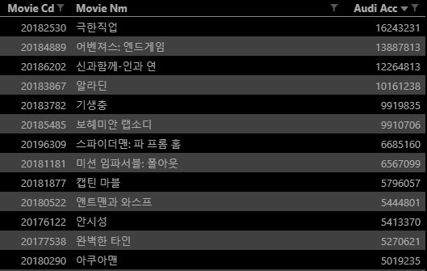
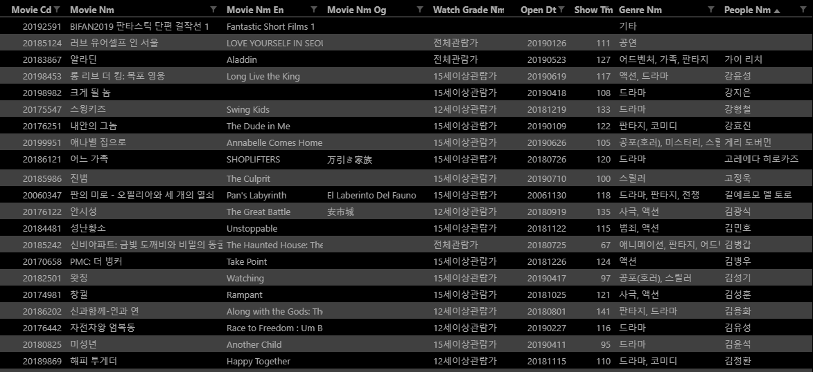
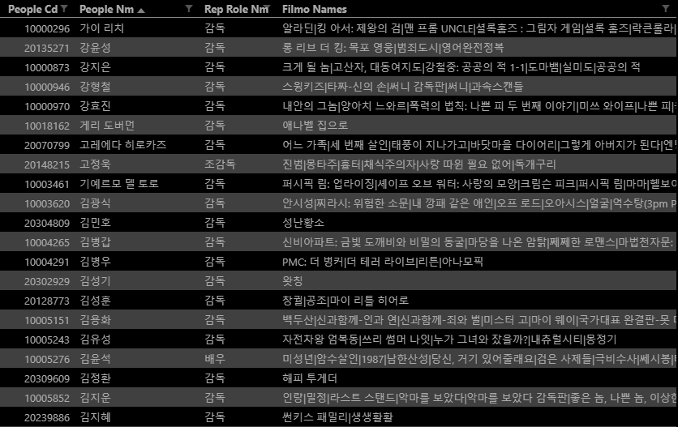

# PJT-01

## 파이썬을 활용한 데이터 수집 I

사용 API

[영화관입장권통합전산망 오픈 API](http://www.kobis.or.kr/kobisopenapi/homepg/apiservice/searchServiceInfo.do) 에서 필요한 requests 양식을 받아옵니다.

### 1. 영화진흥위원회 오픈 API(주간/주말 박스오피스 데이터) - 01.py

#### 최근 50주간 데이터 중에 주간 박스오피스 TOP10데이터를 수집합니다. 해당 데이터는 향후 영화평점서비스에서 기본으로 제공되는 영화 목록으로 사용될 예정입니다.

기본 요청 URL : http://www.kobis.or.kr/kobisopenapi/webservice/rest/boxoffice/searchWeeklyBoxOfficeList.json

json 형식으로 요청하는 URL 입니다.

``` python
import requests
from datetime import datetime, timedelta # 시간정보 쉽게 입력
from decouple import config # .env 를 이용해서 정보 보안
import csv

my_data = {} # 불러온 정보를 dictionary 로 저장
for i in range(51):
    targetDt = datetime(2019, 7, 13) - timedelta(weeks=50-i) # 50주 전부터 기준 일까지
    # 딕셔너리 형식으로 정보를 받을 예정이므로 누적관객수에 자동으로 최신 정보 반영
    targetDt = targetDt.strftime('%Y%m%d')

    key = config('API_KEY') # 환경변수로 key값 호출
    base_url = 'http://www.kobis.or.kr/kobisopenapi/webservice/rest/boxoffice/searchWeeklyBoxOfficeList.json'
    api_url = f'{base_url}?key={key}&targetDt={targetDt}&weekGb=0' 
    # weekGb 를 통해 주간(월~일)정보 조회
    # 요청조건 3 ~ 5 는 default 값이므로 따로 설정할 필요 無

    response = requests.get(api_url)
    data = response.json()
```

```python
    weeklyBoxOfficeList = data.get('boxOfficeResult').get('weeklyBoxOfficeList')

    for boxoffice in weeklyBoxOfficeList:
        movie_info = {}
        movie_info['movieCd'] = boxoffice.get('movieCd') # 영화 대표코드
        movie_info['movieNm'] = boxoffice.get('movieNm') # 영화명
        movie_info['audiAcc'] = boxoffice.get('audiAcc') # 누적관객수
        my_data[movie.get('movieCd')] = movie_info
```

`movie_info` 변수를 딕셔너리 형식으로 받고 위에 선언한 `my_data['영화 대표코드']` 에 저장합니다.

```python
with open('boxoffice.csv', 'w', newline='', encoding='utf-8') as f:
    # 저장할 필드의 이름을 미리 지정
    fieldnames = ('movieCd', 'movieNm', 'audiAcc')
    writer = csv.DictWriter(f, fieldnames=fieldnames)

    # 필드 이름을 csv 파일 최상단에 작성
    writer.writeheader()

    # Dictionary 를 순회하며 key 값에 맞는 value 를 한 줄씩 작성
    for movie in my_data.values():
        writer.writerow(movie)
        # boxoffice.csv 파일에 위에서 처리한 정보를 저장
```

boxoffice.csv 파일 출력 예시



### 2. 영화진흥위원회 오픈 API(영화 상세정보) - 02.py

#### 위에서 수집한 영화 대표코드를 활용하여 상세 정보를 수집합니다. 해당 데이터는 향후 영화평점서비스에서 영화 정보로 활용될 것입니다.

기본 요청 URL : http://www.kobis.or.kr/kobisopenapi/webservice/rest/movie/searchMovieInfo.json

```python
import requests
# from pprint import pprint
from decouple import config # .env 를 이용해서 정보 보안
import csv

movies_info = {}
with open('boxoffice.csv', 'r', newline='', encoding='utf-8') as f:
    reader = csv.DictReader(f) # 위에서 받아온 boxoffice.csv 를 읽어옴

    for row in reader:
        movieCd = row['movieCd'] # 영화 대표코드를 이용해서 해당 영화 정보를 요청

        key = config('API_KEY')
        base_url = 'http://www.kobis.or.kr/kobisopenapi/webservice/rest/movie/searchMovieInfo.json'
        api_url = f'{base_url}?key={key}&movieCd={movieCd}'

        response = requests.get(api_url)
        data = response.json()
```


```python
        movie = data.get('movieInfoResult').get('movieInfo')
        movie_info = {}
        movie_info['movieCd'] = movie['movieCd'] # 영화 대표 코드
        movie_info['movieNm'] = movie['movieNm'] # 영화명 (국문)
        movie_info['movieNmEn'] = movie['movieNmEn'] # 영화명 (영문)
        movie_info['movieNmOg'] = movie['movieNmOg'] # 영화명 (원문)
        if len(movie.get('audits')) != 0:
            movie_info['watchGradeNm'] = movie.get('audits')[0].get('watchGradeNm') # 관람등급
        else:
            movie_info['watchGradeNm'] = ''
            # 관람등급이 없는 영화는 '' 빈 칸으로 처리
        movie_info['openDt'] = movie['openDt'] # 개봉연도
        movie_info['showTm'] = movie['showTm'] # 상영시간
        genres = []
        for i in range(len(movie.get('genres'))):
            genres.append(movie.get('genres')[i].get('genreNm'))
        movie_info['genreNm'] = ', '.join(genres) # 장르
        # 장르가 여러 개인 경우 , 를 이용해 구분
        directors = []
        for i in range(len(movie.get('directors'))):
            directors.append(movie.get('directors')[i].get('peopleNm'))
        movie_info['peopleNm'] = ', '.join(directors) # 감독명
        # 감독이 여러 명인 경우 , 를 이용해 구분
        movies_info[movie['movieCd']] = movie_info # 영화 정보를 movies_info 딕셔너리에 저장
```

```python
with open('movie.csv', 'w', newline='', encoding='utf-8') as f:
    fieldnames = ('movieCd', 'movieNm', 'movieNmEn', 'movieNmOg', 'watchGradeNm', 'openDt', 'showTm', 'genreNm', 'peopleNm')
    writer = csv.DictWriter(f, fieldnames=fieldnames)
    
    writer.writeheader()

    for movie in movies_info.values():
        writer.writerow(movie) # 위에서 받아온 정보를 movie.csv 에 저장
```

movie.csv 출력 예시



### 3. 영화진흥위원회 오픈 API(영화인 정보) - 03.py

#### 위에서 수집한 영화 감독정보를 활용하여 상세 정보를 수집합니다. 해당 데이터는 향후 영화평점서비스에서 감독 정보로 활용될 것입니다.

```python
import requests
from decouple import config # .env 를 이용해서 정보 보안
import csv

directors_info = {}
with open('movie.csv', 'r', newline='', encoding='utf-8') as f:
    reader = csv.DictReader(f)

    for row in reader:
        peopleNms = row['peopleNm'].split(', ') # 감독 이름을 읽어옴
        movieNm = row['movieNm'] # 영화 이름을 읽어옴
        for i in range(len(peopleNms)): # 감독 이름이 여러명인 경우 ', ' 를 기준으로 나눔
            peopleNm = peopleNms[i]
            key = config('API_KEY')
            base_url = 'http://www.kobis.or.kr/kobisopenapi/webservice/rest/people/searchPeopleList.json'
            api_url = f'{base_url}?key={key}&peopleNm={peopleNm}'

            response = requests.get(api_url)
            data = response.json()
```

```python
            peoplelist = data.get('peopleListResult').get('peopleList')
            director_info = {}
            for peopleinfo in peoplelist:
                if movieNm in peopleinfo['filmoNames']: 
                    # movie.csv 에서 받아온 영화코드와 새로 요청한 정보의 필모그래피 비교
                    director_info['peopleCd'] = peopleinfo['peopleCd']
                    director_info['peopleNm'] = peopleinfo['peopleNm']
                    director_info['repRoleNm'] = peopleinfo['repRoleNm']
                    director_info['filmoNames'] = peopleinfo['filmoNames']

                    directors_info[peopleinfo['peopleCd']] = director_info
                    break # 찾았다면 정보를 기록하고 루프를 벗어남
                else:
                    pass # 못찾았다면 아무 정보도 기록하지 않음
```

``` python
with open('director.csv', 'w', newline='', encoding='utf-8') as f:
    fieldnames = ('peopleCd', 'peopleNm', 'repRoleNm', 'filmoNames')
    writer = csv.DictWriter(f, fieldnames=fieldnames)
    
    writer.writeheader()

    for director in directors_info.values():
        writer.writerow(director) # 읽어온 정보를 한 줄씩 director.csv 에 저장
```

director.csv 파일 출력 예시

