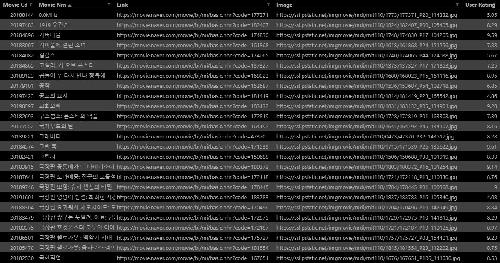

# PJT-02

## 파이썬을 활용한 데이터 수집 II

### 사용 API

[네이버 영화 검색 API](https://developers.naver.com/docs/search/movie/) 을 통해 Application 을 등록하여 Client ID 와 Client Secret 을 받습니다.

기본 요청 URL: https://openapi.naver.com/v1/search/movie.json

json 형식으로 요청하기 위한 URL 입니다. get 메서드를 사용합니다.

### 1. 네이버 영화 검색 API - `movie_naver.py`

지난 프로젝트(파이썬을 활용한 데이터 수집 I)에서 얻은 영화명(국문)을 바탕으로 네이버 영화 검색 API를 통해 추가적인 데이터를 수집합니다. 해당 데이터는 향후 영화평점서비스에서 기준 평점 및 영화 포스터 썸네일로 활용될 것입니다.

- 요청

  영화명을 통해 요청합니다. 

  `query` 에 영화명을 넘겨줍니다.

  ```python
  import requests  # 요청을 보낼 때 필요한 모듈
  # from pprint import pprint  # 출력 결과를 해석하기 쉽게 해줌
  from decouple import config  # 환경변수를 사용해 클라이언트 ID, Secret 보안
  import csv  # csv 파일 핸들링
  from time import sleep
  # for문을 통해 빠르게 요청 반복 시 요청을 거부당하는 것을 방지하기 위해 time 모듈 import
  
  movies_info = {}  # 받아온 영화 정보를 dict 형식으로 저장
  with open('../pjt_01/movie.csv', 'r', newline='', encoding='utf-8') as f:
      # 이전 디렉토리/pjt_01/movie.csv 파일을 read
      reader = csv.DictReader(f)
  
      for row in reader:
          query = row['movieNm']  # 필수 요청 정보인 query 에 movie.csv 에서 받아온 영화명 저장
          movieCd = row['movieCd']  # 영화 코드를 키 값으로 새로 받아올 영화 정보 저장
          peopleNm = row['peopleNm'].split(', ')  # 동명의 영화가 많을 경우 감독 이름을 비교하기 위해
  
          HEADERS = {
              'X-Naver-Client-Id': config('CLIENT_ID'),
              'X-Naver-Client-Secret': config('CLIENT_SECRET'),
          }  # 헤더에 중요 정보 저장
          BASE_URL = 'https://openapi.naver.com/v1/search/movie.json'  # 기본 요청 URL
          API_URL = f'{BASE_URL}?query={query}'  # ? 를 이용해 요청정보 입력
          									# 필수 요청정보 외에는 default 값으로 요청
          response = requests.get(API_URL, headers=HEADERS)
          data = response.json()  # json 형식으로 변환
  ```

- 응답

  - 영화별로 다음과 같은 내용을 저장합니다.

    `영진위 영화 대표코드`, `하이퍼텍스트 link`, `영화 썸네일 이미지의 URL`, `유저 평점`

  - `영화 썸네일 이미지의 URL` 이 없는 경우 저장하지 않습니다.

  ```python
          movies = data.get('items')  # query 를 통해 검색한 영화 정보들을 저장
          if len(movies) == 1:  # 검색한 영화 결과가 1 일 경우
              movie = movies[0] # [0]번 인덱스 값을 바로 movie 변수에 저장
          else:
              for target in movies:  # 검색 결과가 여러 개인 경우 (동명의 영화가 2개 이상)
                  for directorNm in peopleNm[0].split():
                      # 감독이 여러명인 경우에 [0]번 인덱스만 비교
                      # 외국인 감독의 경우 영진위와 네이버의 표기가 다른 경우 존재하므로
                      # 띄어쓰기를 기준으로 이름을 나누어 비교
                      # ex) 영진위 제공 '데이빗 야로베스키' / 네이버 제공 '데이비드 야로베스키'
                      # => 데이빗 / 야로베스키 로 나누어
                      # => if   '데이빗'  in '데이비드 야로베스키'
                      # => if '야로베스키' in '데이비드 야로베스키' 식으로 비교
                      if directorNm in target.get('director'):  # 감독명.split() 중 같은 결과가 있다면
                          movie = target  # movie 변수에 해당 결과를 저장한 뒤 break
                          break
          
          movie_info = {}
          movie_info['movieCd'] = movieCd  # 영화코드를 key 값으로 정보 저장
          movie_info['movieNm'] = query
          # 오류로 인해 중복된 영화가 있는지 확인을 쉽게 하기 위해 추가로 영화명 저장
          
          movie_info['link'] = movie.get('link')  # 영화 링크
          
          if query == '이웃집 토토로':  # 영화 이미지 링크
              # 이웃집 토토로의 경우 링크에서 이미지 파일을 읽을 수 없어 예외로 처리
              movie_info['image'] = 'https://ssl.pstatic.net/imgmovie/mdi/mit110/0187/A8781-00.jpg'
          else:
              movie_info['image'] = movie.get('image')
          
          movie_info['userRating'] = movie.get('userRating')  # 유저 평점
          # .get() 을 통해 정보를 받아오므로 해당 키값이 없다면 None을 반환
          
          movies_info[movieCd] = movie_info  # 받아온 정보를 movies_info dict 에 저장
          
          sleep(0.1)  # 요청 사이에 텀을 추가하여 요청 거부 방지
  ```

  - 해당 결과를 **movie_naver.csv**에 저장합니다.

  ```python
  with open('movie_naver.csv', 'w', newline='', encoding='utf-8') as f:
      fieldnames = ('movieCd', 'movieNm', 'link', 'image', 'userRating')
      writer = csv.DictWriter(f, fieldnames=fieldnames)
      
      writer.writeheader()
  
      for movie in movies_info.values():
          writer.writerow(movie)
  ```

  `movie_naver.csv` 출력예시

  

### 2. 영화 포스터 이미지 저장 - `movie_image.py`

앞서 네이버 영화 검색 API를 통해 얻은 이미지 URL에 요청을 보내 실제 이미지 파일로 저장합니다. 해당 데이터는 향후 영화 목록에서 포스터 이미지로 사용될 것입니다.

- 요청

  `영화 썸네일 이미지의 URL`

- 응답

  응답 받은 결과를 파일로 저장합니다. 반드시 `wb` 옵션으로 저장하시기 바랍니다.

  저장되는 파일명은 `images 폴더` 내에 `영진위 영화 대표코드.jpg` 입니다.

  ```python
  import requests
  import csv
  
  with open('movie_naver.csv', 'r', newline='', encoding='utf-8') as f:
      # movie_naver.py 에서 받아온 csv 파일을 read
      reader = csv.DictReader(f)
  
      for row in reader:
          thumb_url = row['image']  # 영화 썸네일 이미지의 URL
          movieCd = row['movieCd']  # 이미지 파일 이름에 사용하기 위해 movieCd 받아옴
  
          with open(f'images/{movieCd}.jpg', 'wb') as f: # wb 옵션 (write binary)
              # images 폴더 내에 영화코드.jpg 이름으로 저장
              response = requests.get(thumb_url)
              f.write(response.content)
              
  ```

  `movieCd.jpg` 파일 예시

  

