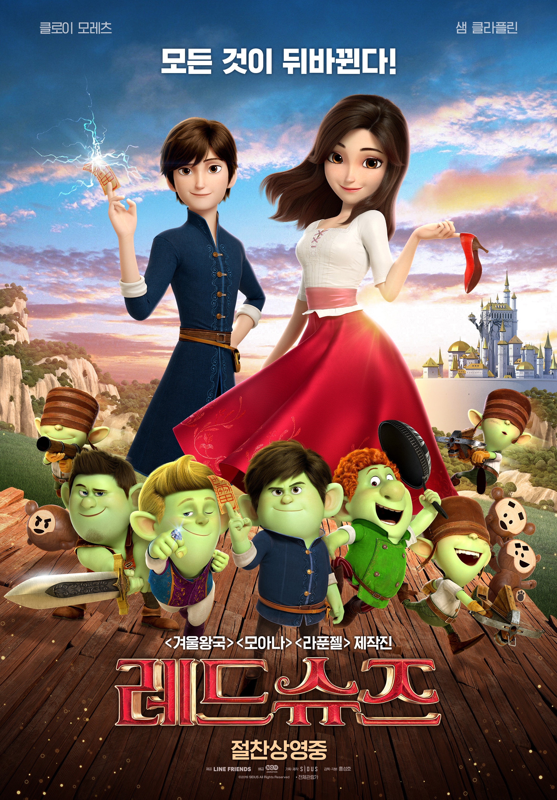

# PJT 03 - Web(HTML/CSS 를 활용한 웹 사이트 구성)

## 1. HTML 기초

```html
<!DOCTYPE html>
<html lang="ko">
<head>
  <meta charset="UTF-8">
  <meta name="viewport" content="width=device-width, initial-scale=1.0">
  <meta http-equiv="X-UA-Compatible" content="ie=edge">
  <title>영화 추천 서비스</title>
```

## 2. `header`

### 웹 사이트의 헤더 부분에는 로고 이미지와 네비게이션 바를 구성합니다.

```html
  <header>
    <a href="/">
      
    </a>
    <!-- 네비게이션 바 -->
    <nav>
      <ul class="nav-items">
        <li><a href="#">Main</a></li>
        <li><a href="#">Box office</a></li>
        <li><a href="#">영화 상영작</a></li>
        <li><a href="#">About</a></li>
      </ul>
    </nav>
  </header>
```


```css
/* header */
header {
  position: fixed;  /* 고정 */
  top: 0;  /* 항상 상단 */
  z-index: 1000;  /* 맨 위에 표시 */
}
```

```css
/* header */
header {
  width: 100%;
  height: 80px;  /* 높이 80px */
  padding: 0 40px; /* 좌우 여백 40px */
  line-height: 70px;
  background-color: #fff;
}

.logo {
  height: 60px;
}
```

```css
/* layout.css nav */
nav {
  /* navigation 항목을 오른쪽으로 정렬 */
  float: right;
}

.nav-items > li {
  /* navigation 항목을 한 줄로 */
  display: inline-block;
  /* 좌우 여백 10px */
  margin: 0 10px;
  /* li 태그의 bullet point를 제거 */
  list-style: none;
}

.nav-items > li > a {
  /* a tag는 링크 생상 변경 */
  color: #111;
}

.nav-items > li > a:hover {
  /* hover(마우스 오버)시 색상 변경 */
  color: rgb(23, 40, 114);
  /* a tag 마우스 오버시 밑줄 제거 */
  text-decoration: none;

}
```

```css
/* style.css nav */
.nav-items {
  margin: 0;
}
```

## 3. title `section`

### 서비스를 소개하는 문구와 배경 이미지가 있는 섹션을 구성합니다.

```html
  <section id="section-title">
    <h1 class="section-title-heading">영화 추천 서비스</h1>
  </section>
```

```css
/* layout.css title section */
#section-title {
  /* 배경 이미지 적용 (images/background.jpg) */
  background-image: url("images/background.jpg");
  background-size: cover;
  background-position: center;
  /* 텍스트 가운데 정렬 */
  text-align: center;
  /* 텍스트 수직 가운데 정렬 (section-title 높이 300px) */
  line-height: 300px;
}

.section-title-heading {
  /* font size 조정 */
  font-size: 3rem;

}
```

```css
/* style.css title section */
#section-title {
  clear: left;
  width: 100%;
  height: 320px;
  margin-top: 80px;
  background-color: #fff;
}
```

## 4. `aside`

### 좌측 레이아웃에 장르 목록을 구성합니다.

```css
/* style.css content */
#content {
  position: relative;
}
```

```html
    <aside>
      <h2>장르 목록</h2>
      <ul class="aside-items">
        <li>액션</li>
        <li>가족</li>
        <li>코미디</li>
        <li>히어로</li>
      </ul>
    </aside>
```


```css
/* layout.css aside */
aside {
  /* 
    aside를 부모인 div#content의 영역에 위치.
    div#content는 position: relative
  */
  position: absolute;
  /* 맨 위로 위치 */
  top: 0;
}

.aside-items {
  /* ul 태그의 padding 제거 */
  padding: 0;
}

.aside-items > li {
  /* li 태그의 bullet point 제거 */
  list-style: none;
}

```

```css
/* style.css aside */
aside {
  width: 160px;
  padding: 24px;
}
```

## 5. movie `section`

### 우측 레이아웃에 제공된 영화 포스터를 활용하여 실시간 영화 순위 목록을 구성합니다.

```html
    <section id="section-movie">
      <h2>실시간 영화 순위</h2>
      <div class="section-movie-items">
        <div class="movie-item">
          
          <h3 class="movie-item-title">엑시트</h3>
          <p></p>
        </div>
        <div class="movie-item">
          
          <h3 class="movie-item-title">사자</h3>
        </div>
        <div class="movie-item">
          
          <h3 class="movie-item-title">마이펫의 이중생활2</h3>
        </div>
        <div class="movie-item">
          
          <h3 class="movie-item-title">라이온킹</h3>
        </div>
        <div class="movie-item">
          
          <h3 class="movie-item-title">알라딘</h3>
        </div>
        <div class="movie-item">
          
          <h3 class="movie-item-title">레드슈즈</h3>
        </div>
      </div>
    </section>
```

```css
/* style.css movie section */
#section-movie {
  padding: 24px;  /* 상하 좌우 여백 */
  margin-bottom: 40px;
  margin-left: 160px;
  background-color: #eee;
  text-align: center;
}
.section-movie-items {
  display: flex;
  flex-wrap: wrap;
  justify-content: space-around;
  width: 100%;
}
.movie-item {
  width: 30%;
}
.movie-item-poster {
  width: 300px;
  border-radius: 3%;
}
```

## 6. `footer`

### 연도와 이름이 작성된 푸터를 구성합니다.

```html
  <footer>
    Project #3 created by GH-Lim , 2019
  </footer>
```

```css
/* layout.css footer */
footer {
  /* footer 항상 바닥에 위치하도록 설정 */
  position: fixed;
  bottom: 0;
  /* 텍스트 가운데 정렬 */
  text-align: center;
  /* 텍스트 수직정렬 (footer 높이 50px) */
  line-height: 50px;
}
```

```css
/* style.css footer */
footer {
  width: 100%;
  height: 40px;
  background-color: #000;
  color: white;
}
```

## 예시 스크린샷


