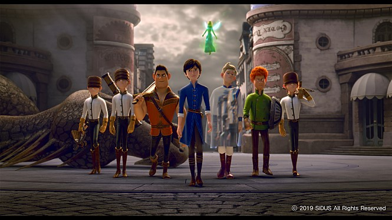

# PJT-04

## Web 반응형 웹사이트 구성

### 1. 영화 추천 사이트를 위한 레이아웃 구성 (1)

- 영화 추천 사이트 메인 페이지 기초 레이아웃을 구성합니다.

1. HTML 기초

   ```html
   <!DOCTYPE html>
   <html lang="ko">
   
   <head>
     <meta charset="UTF-8">
     <meta name="viewport" content="width=device-width, initial-scale=1.0">
     <meta http-equiv="X-UA-Compatible" content="ie=edge">
     <title>영화 추천 서비스</title>
   </head>
   ```

2. Navigation Bar

   `justify-content-end` 를 이용해 우측정렬합니다.

   ```html
     <nav class="navbar navbar-expand-lg navbar-light bg-light sticky-top">
       <a class="navbar-brand" href="#">영화추천시스템</a>
       <button class="navbar-toggler" type="button" data-toggle="collapse" data-target="#navbarNavAltMarkup"
         aria-controls="navbarNavAltMarkup" aria-expanded="false" aria-label="Toggle navigation">
         <span class="navbar-toggler-icon"></span>
       </button>
       <div class="collapse navbar-collapse justify-content-end" id="navbarNavAltMarkup">
         <div class="navbar-nav">
           <a class="nav-item nav-link active" href="#">Home <span class="sr-only">(current)</span></a>
           <a class="nav-item nav-link disabled" href="#">친구평점보러가기</a>
           <a class="nav-item nav-link disabled" href="#" tabindex="-1" aria-disabled="true">Login</a>
         </div>
       </div>
     </nav>
   ```

3. Header

   ```html
     <header id="go-top">
       <h2 class="text-secondary text-center">당신이 좋아할 만한<br>영화를 준비했습니다.</h2>
     </header>
   ```

   ```css
   header {
     display: flex;
     width: 100%;
     height: 350px;  /* 높이 80px */
     padding: 0 40px; /* 좌우 여백 40px */
     background-color: #fff;
     /* 배경 이미지 적용 (images/background.jpg) */
     background-image: url("images/header.jpg");
     background-size: cover;
     background-position: center;
     /* 텍스트 가운데 정렬 */
     justify-content: center;
     /* 텍스트 수직 가운데 정렬 (section-title 높이 300px) */
     align-items: center;
     font-family: 'Nanum Brush Script', cursive;
   }
   ```

4. Footer

   화살표 모양 아이콘에 a tag 를 이용해 클릭 시 헤더로 이동하게 합니다.

   ```html
     <footer class="bg-light">
       <span class="text-secondary">Copyright ⓒ 2019 GH-Lim All rights reserved.</span>
       <a class="text-secondary" href="#go-top" id="go-up"><i class="fas fa-arrow-alt-circle-up"></i></a>
     </footer>
   ```

   ```css
   footer {
     display: flex;
     width: 100%;
     height: 50px;
     padding: 0 3rem;
     position: absolute;
     bottom: auto;
     align-items: center;
     justify-content: space-between;
     font-family: 'Sunflower', sans-serif;
   }
   
   #go-up {
     font-size: 1.5rem;
   }
   ```

5. Font 설정

   ```html
   <link href="https://fonts.googleapis.com/css?family=Hi+Melody|Nanum+Brush+Script|Sunflower:300&display=swap&subset=korean" rel="stylesheet">
   ```

   구글 font를 이용해 글꼴을 불러옵니다.

   ```css
   footer {
   font-family: 'Sunflower', sans-serif;
   }
   ```


### 2. 영화 추천 사이트를 위한 영화 리스트 구성 (2)

- 영화 목록 섹션 레이아웃을 만듭니다.

1. 레이아웃

   ```html
     <div class="container" id="movie-list">
     </div>
   ```

   컨테이너 안쪽에 무비 리스트를 만듭니다.

2. Subtitle

   밑줄의 길이를 `4rem` 으로 설정합니다.

   `my-5` : subtitle 영역의 위 아래 margin을 `3rem` 만큼 줍니다.

   ```html
       <div class="my-5" id="subtitle">
         <h3 class="text-center">영화 목록</h3>
         <hr class="border border-warning">
       </div>
   ```

   ```css
   #subtitle > hr {
     width: 4rem;
   }
   ```

3. Card view

   ```html
       <div class="row">
         <div class="col-lg-3 col-md-4 col-sm-6 col-12 py-2 px-1">
           <div class="card">
             
             <div class="card-body">
               <h4 class="card-title">레드슈즈<br><span class="badge badge-info">9.24</span></h4>
               <hr>
               <p class="card-text">애니메이션</p>
               <p class="card-text">개봉일: 2019.07.25.</p>
               <a href="https://movie.naver.com/movie/bi/mi/basic.nhn?code=164907" class="btn btn-success"
                 target="_blank">영화정보 보러가기</a>
             </div>
           </div>
         </div>
   ```


### 영화 상세 보기

- 영화 상세 보기 레이아웃을 만듭니다.

1. Modal

   ```html
   
   ```

   카드의 이미지에 `data-toggle="modal"` `data-target="#movie-#-modal"` 을 추가 합니다.

   ```html
   <!-- Modal -->
     <div class="modal fade" id="movie-1-modal" tabindex="-1" role="dialog" aria-labelledby="movie-1-Label"
       aria-hidden="true">
       <div class="modal-dialog" role="document">
         <div class="modal-content">
           <div class="modal-header">
             <h5 class="modal-title" id="movie-1-Label">레드슈즈, Red Shoes</h5>
             <button type="button" class="close" data-dismiss="modal" aria-label="Close">
               <span aria-hidden="true">&times;</span>
             </button>
           </div>
           <!-- carousel -->
           <div id="carousel-movie-1-Indicators" class="carousel slide" data-ride="carousel">
             <ol class="carousel-indicators">
               <li data-target="#carousel-movie-1-Indicators" data-slide-to="0" class="active"></li>
               <li data-target="#carousel-movie-1-Indicators" data-slide-to="1"></li>
               <li data-target="#carousel-movie-1-Indicators" data-slide-to="2"></li>
             </ol>
             <div class="carousel-inner">
               <div class="carousel-item active">
                 
               </div>
               <div class="carousel-item">
                 
               </div>
               <div class="carousel-item">
                 
               </div>
             </div>
             <a class="carousel-control-prev" href="#carousel-movie-1-Indicators" role="button" data-slide="prev">
               <span class="carousel-control-prev-icon" aria-hidden="true"></span>
               <span class="sr-only">Previous</span>
             </a>
             <a class="carousel-control-next" href="#carousel-movie-1-Indicators" role="button" data-slide="next">
               <span class="carousel-control-next-icon" aria-hidden="true"></span>
               <span class="sr-only">Next</span>
             </a>
           </div>
   
           <div class="modal-body">
             <p>전체관람가</p>
             <p>누적 관객수: 527,430</p>
             <hr>
             <p>
               사건 사고가 끊이지 않는 동화의 섬. 사라진 아빠를 찾던 화이트 왕국의 공주는
               우연히 마법구두를 신고 이전과 완벽하게 다른 ‘레드슈즈’로 거듭난다. 
               한편, 초록색 난쟁이가 된 일곱 왕자들은 우연히 자신들의 집에 머물게 된 '레드슈즈’가 
               저주를 풀 유일한 희망이라 생각해 그녀를 돕기 시작하고, 영원한 아름다움을 꿈꾸는 왕비 ‘레지나’는 
               마법구두를 신고 성을 빠져나간 ‘레드슈즈’를 쫓기 시작하는데… 
               <br><br>
               위기에 빠진 동화의 섬, 
               레드슈즈, 그리고 일곱 왕자들의 운명은?
             </p>
           </div>
           <div class="modal-footer">
             <button type="button" class="btn btn-secondary" data-dismiss="modal">Close</button>
           </div>
         </div>
       </div>
     </div>
   
   ```

   각 `modal` 요소마다 `id` 와 `data-target` 을 설정해줍니다.

   `.modal-head` 와 `.modal-body` 사이에 이미지를 carousel 을 이용해 삽입합니다.

   `carousel` 역시 각 그림마다 `id` 와 `data-target` 을 설정해줍니다.


### 최종 결과물


