# PJT-05

## Django

### Project name:  pjt_05 / App name: movies

- `requirements.txt`

```markdown
Django==2.2.4
pytz==2019.2
sqlparse==0.3.0
```

- `base.html`

  Bootstrap을 포함한 html 템플릿을 만들어 활용합니다.

### 1. 데이터베이스

- ORM 을 통해 작성될 클래스 명: `Movie`

- <b>Movie</b>

  | 필드명      | 자료형  | 설명              |
  | ----------- | ------- | ----------------- |
  | title       | string  | 영화명            |
  | title_en    | string  | 영화명(영문)      |
  | audience    | Integer | 누적 관객수       |
  | open_date   | date    | 개봉일            |
  | genre       | string  | 장르              |
  | watch_grade | string  | 관람등급          |
  | score       | Float   | 평점              |
  | poster_url  | text    | 포스터 이미지 url |
  | description | text    | 영화 소개         |

```python
from django.db import models

class Movie(models.Model):
    title = models.CharField(max_length=20)
    title_en = models.CharField(max_length=20)
    audience = models.IntegerField()
    open_date = models.DateField(auto_now=False, auto_now_add=False)
    genre = models.CharField(max_length=20)
    watch_grade = models.CharField(max_length=20)
    score = models.DecimalField(max_digits=4, decimal_places=2)
    # 소수점 두자리까지 입력가능합니다.
    poster_url = models.TextField()
    description = models.TextField()

```

### 2. 페이지

- `movies` > `url.py` 해당 페이지에 접근하는 URL 정보가 담겨있습니다.

```python
# movies > url.py
from django.urls import path
from . import views

urlpatterns = [
    path('', views.index),
    path('<int:movie_pk>/', views.detail),
    path('new/', views.new),
    path('create/', views.create),
    path('<int:movie_pk>/edit/', views.edit),
    path('<int:movie_pk>/update/', views.update),
    path('<int:movie_pk>/delete/', views.delete),
]
```


1. 영화 목록

   ```python
   # movies > views.py
   def index(request):
       movies = Movie.objects.all()
       # Movie 데이터 베이스에 담긴 모든 정보를 받아옵니다.
       context = {
           'movies': movies,
       }
       return render(request, 'movies/index.html', context)
   ```

   ```django
    <!-- 템플릿을 만들어 활용합니다. -->
   Movie List
   
   
     <a href="/movies/new/">새 영화 등록</a>
     <ul>
     
       <li><h2 class="d-inline">제목 : <a href="/movies/{{ movie.pk }}/">{{ movie.title }}</a></h2><p class="d-inline"> 평점 : {{ movie.score }}</p></li>
     
     </ul>
   
   ```

   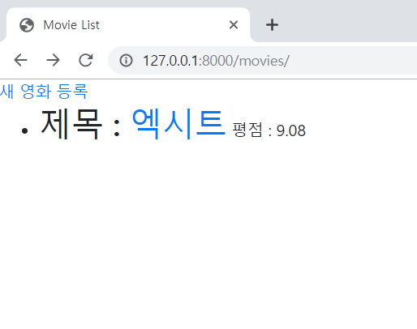

2. 영화 정보 생성 Form

   Movie Form

   | 필드명      | HTML Tag | Type   |
   | ----------- | -------- | ------ |
   | title       | input    | text   |
   | title_en    | input    | text   |
   | audience    | input    | number |
   | open_date   | input    | date   |
   | genre       | input    | text   |
   | watch_grade | input    | text   |
   | score       | input    | number |
   | poster_url  | input    | text   |
   | description | textarea | 없음   |

   

   ```python
   def new(request):
       return render(request, 'movies/new.html')
   # form 을 제출하는 양식만 보여주는 곳이기 때문에 페이지만 return 합니다.
   ```

   form 태그를 이용해 입력을 받는 페이지를 작성합니다.

   `name` 을 이용해 `views.py` 에서 submit 결과를 받을 수 있도록 합니다.

   ```django
   
   
   Movie Register
   
   
     <div class="container">
       <h1>영화 정보 생성</h1>
       <form action="/movies/create/">
         <div class="form-group">
           <label for="title">영화명</label>
           <input class="form-control" type="text" id="title" name="title">
         </div>
         <div class="form-group">
           <label for="title_en">영화명(영문)</label>
           <input class="form-control" type="text" id="title_en" name="title_en">
         </div>
         <div class="form-group">
           <label for="audience">누적 관객수</label>
           <input class="form-control" type="number" min=0 id="audience" name="audience">
         </div>
         <div class="form-group">
           <label for="open_date">개봉일</label>
           <input class="form-control" type="date" id="open_date" name="open_date">
         </div>
         <div class="form-group">
           <label for="genre">장르</label>
           <input class="form-control" type="text" id="genre" name="genre">
         </div>
         <div class="form-group">
           <label for="watch_grade">관람등급</label>
           <input class="form-control" type="text" id="watch_grade" name="watch_grade">
         </div>
         <div class="form-group">
           <label for="score">평점</label>
           <input class="form-control" type="number" step=0.01 min=0 id="score" name="score">
         </div>
         <div class="form-group">
           <label for="poster_url">포스터 이미지 URL</label>
           <input class="form-control" type="text" id="poster_url" name="poster_url">
         </div>
         <div class="form-group">
           <label for="description">영화 소개</label>
           <textarea class="form-control" id="description" rows="3" name="description"></textarea>
         </div>
         <button type="submit" class="btn btn-primary">생성 하기</button>
         <a class="btn btn-secondary" href="/movies/" role="button">취소</a>
       </form>
     </div>
   
   ```

   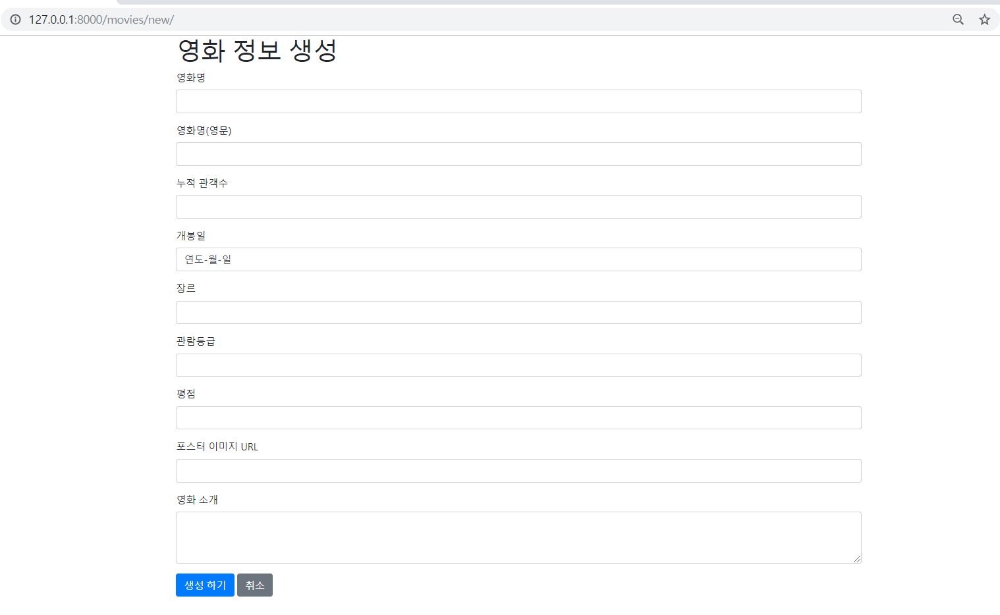

3. 영화 정보 생성

   GET 을 이용해 form 을 통해 입력받은 정보를 저장합니다.

   ```python
   def create(request):
       title = request.GET.get('title')
       title_en = request.GET.get('title_en')
       audience = request.GET.get('audience')
       open_date = request.GET.get('open_date')
       genre = request.GET.get('genre')
       watch_grade = request.GET.get('watch_grade')
       score = request.GET.get('score')
       poster_url = request.GET.get('poster_url')
       description = request.GET.get('description')
   
       movie = Movie(title=title, title_en=title_en, audience=audience, open_date=open_date, genre=genre, watch_grade=watch_grade, score=score, poster_url=poster_url, description=description,)
       movie.save()
   
       return render(request, 'movies/create.html')
   ```

   ```django
   
   
   Create
   
     <h1>영화 정보 생성이 완료되었습니다.</h1>
     <a class="btn btn-secondary" href="/movies/" role="button">영화목록으로</a>
   
   ```

   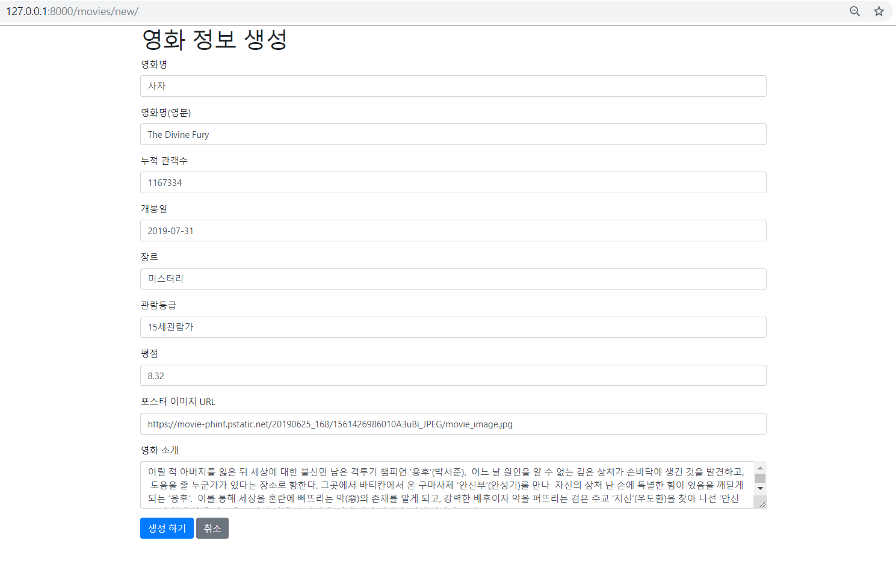

   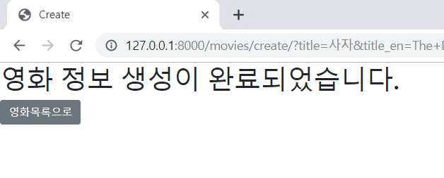

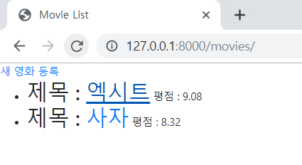

4. 영화 정보 조회

   ```python
   def detail(request, movie_pk):
       # url 에서 받아온 pk 정보를 이용해 해당 영화 정보를 받아옵니다.
       movie = Movie.objects.get(pk=movie_pk)
       context = {'movie': movie}
       return render(request, 'movies/detail.html', context)
   ```

   ```django
   
   {{ movie.title }}
   
   
   
     <h1>{{ movie.title }}</h1>
     <p>{{ movie.title_en }}</p>
     <p>{{ movie.audience }}</p>
     <p>{{ movie.open_date }}</p>
     <p>{{ movie.genre }}</p>
     <p>{{ movie.watch_grade }}</p>
     <p>{{ movie.score }}</p>
     <p>{{ movie.poster_url }}</p>
     <p>{{ movie.description }}</p>
     <a class="btn btn-primary" href="/movies/" role="button">영화 목록</a>
     <a class="btn btn-primary" href="./edit/" role="button">영화 정보 수정</a>
     <a class="btn btn-warning" href="./delete/" role="button">영화 정보 삭제</a>
   
   ```

   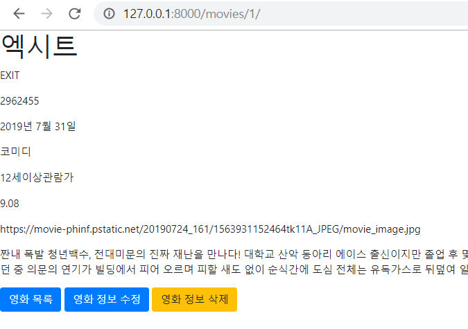

5. 영화 정보 수정 Form

   영화 정보 생성 Form 을 활용하여 value 값을 주어 수정할 수 있게 합니다.

   ```python
   import datetime
   
   def edit(request, movie_pk):
       movie = Movie.objects.get(pk=movie_pk)
       
       yy = movie.open_date.strftime('%Y-%m-%d')
       # 날짜 정보를 string 타입으로 바꿔줍니다.
       context = {
           'movie': movie,
           'yy': yy,
       }
       return render(request, 'movies/edit.html', context)
   ```

   ```django
   
   
   Movie Edit
   
   
     <div class="container">
       <h1>영화 정보 수정</h1>
       <form action="/movies/{{ movie.pk }}/update/">
         <div class="form-group">
           <label for="title">영화명</label>
           <input class="form-control" type="text" id="title" name="title" value="{{ movie.title }}">
         </div>
         <div class="form-group">
           <label for="title_en">영화명(영문)</label>
           <input class="form-control" type="text" id="title_en" name="title_en" value="{{ movie.title_en }}">
         </div>
         <div class="form-group">
           <label for="audience">누적 관객수</label>
           <input class="form-control" type="number" min=0 id="audience" name="audience" value="{{ movie.audience }}">
         </div>
         <div class="form-group">
           <label for="open_date">개봉일</label>
           <input class="form-control" type="date" id="open_date" name="open_date" value="{{ yy }}">
         </div>
         <div class="form-group">
           <label for="genre">장르</label>
           <input class="form-control" type="text" id="genre" name="genre" value="{{ movie.genre }}">
         </div>
         <div class="form-group">
           <label for="watch_grade">관람등급</label>
           <input class="form-control" type="text" id="watch_grade" name="watch_grade" value="{{ movie.watch_grade }}">
         </div>
         <div class="form-group">
           <label for="score">평점</label>
           <input class="form-control" type="number" step=0.01 min=0 id="score" name="score" value="{{ movie.score }}">
         </div>
         <div class="form-group">
           <label for="poster_url">포스터 이미지 URL</label>
           <input class="form-control" type="text" id="poster_url" name="poster_url" value="{{ movie.poster_url }}">
         </div>
         <div class="form-group">
           <label for="description">영화 소개</label>
           <textarea class="form-control" id="description" rows="3" name="description">{{ movie.description }}</textarea>
         </div>
         <button type="submit" class="btn btn-primary">수정 하기</button>
         <a class="btn btn-secondary" href="/movies/" role="button">취소</a>
       </form>
     </div>
   
   ```

   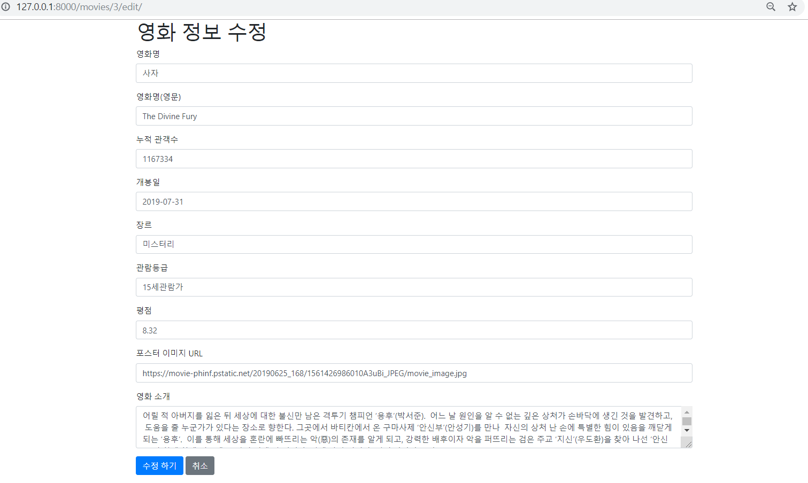

6. 영화 정보 수정

   해당 영화 `pk` 값을 통해 정보를 받아오고 해당 pk 값의 정보를 수정합니다.

   ```python
   def update(request, movie_pk):
       movie = Movie.objects.get(pk=movie_pk)
   
       movie.title = request.GET.get('title')
       movie.title_en = request.GET.get('title_en')
       movie.audience = request.GET.get('audience')
       movie.open_date = request.GET.get('open_date')
       movie.genre = request.GET.get('genre')
       movie.watch_grade = request.GET.get('watch_grade')
       movie.score = request.GET.get('score')
       movie.poster_url = request.GET.get('poster_url')
       movie.description = request.GET.get('description')
   
       movie.save()
   
       return render(request, 'movies/update.html')
   ```

   ```django
   
   
   Update Movie
   
     <h1>영화 정보 수정이 완료되었습니다.</h1>
     <a class="btn btn-secondary" href="/movies/" role="button">영화목록으로</a>
   
   ```

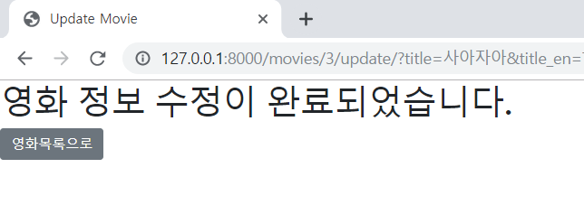

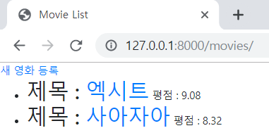

7. 영화 정보 삭제

   ```python
   def delete(request, movie_pk):
       # 해당 키값의 정보를 delete() 메서드를 통해 지웁니다.
       movie = Movie.objects.get(pk=movie_pk)
       movie.delete()
       return render(request, 'movies/delete.html')
   ```

   ```django
   
   Delete Movie
   
   
     <h1>영화 정보 삭제가 완료되었습니다.</h1>
     <a class="btn btn-secondary" href="/movies/" role="button">영화목록으로</a>
   
   ```

   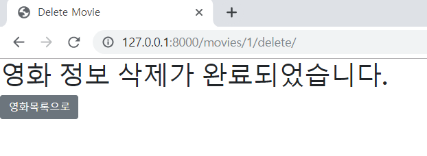

   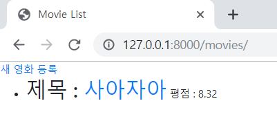

