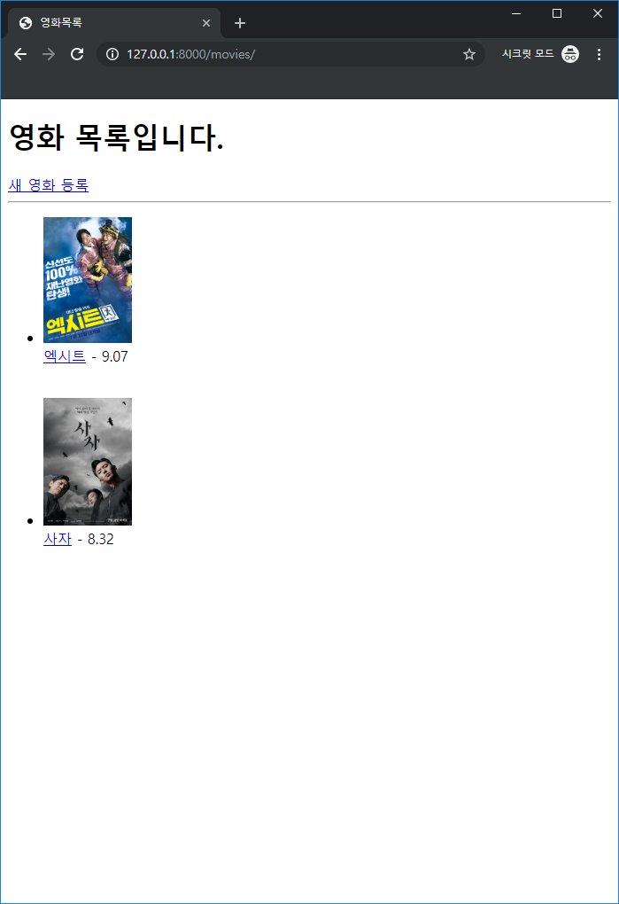
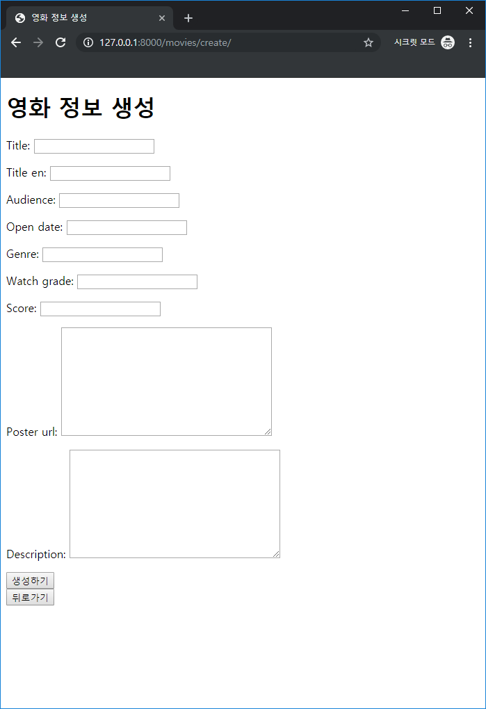
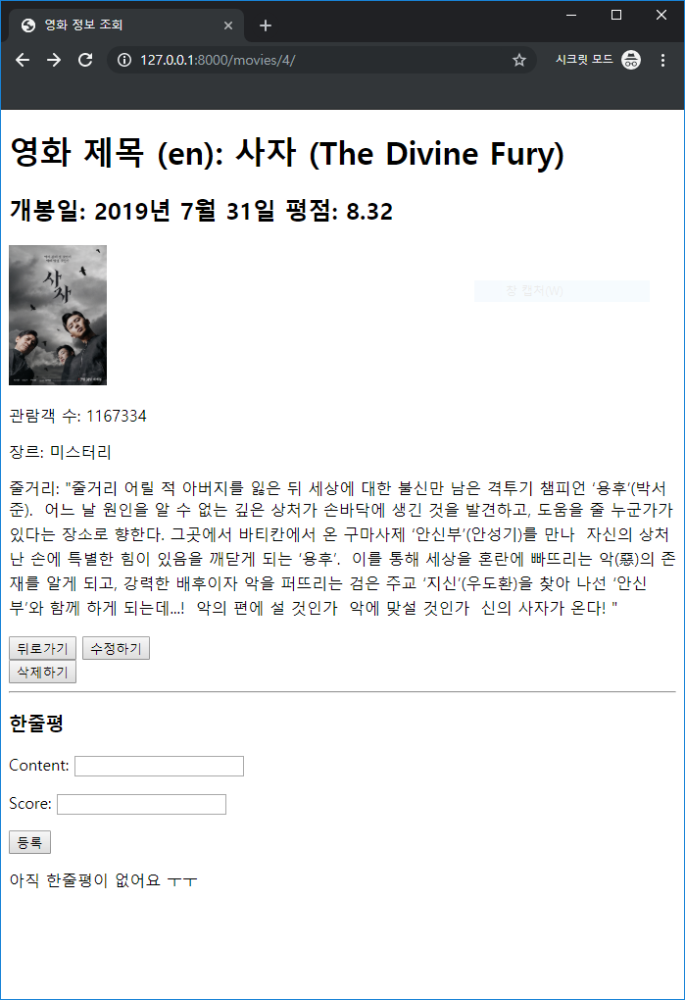
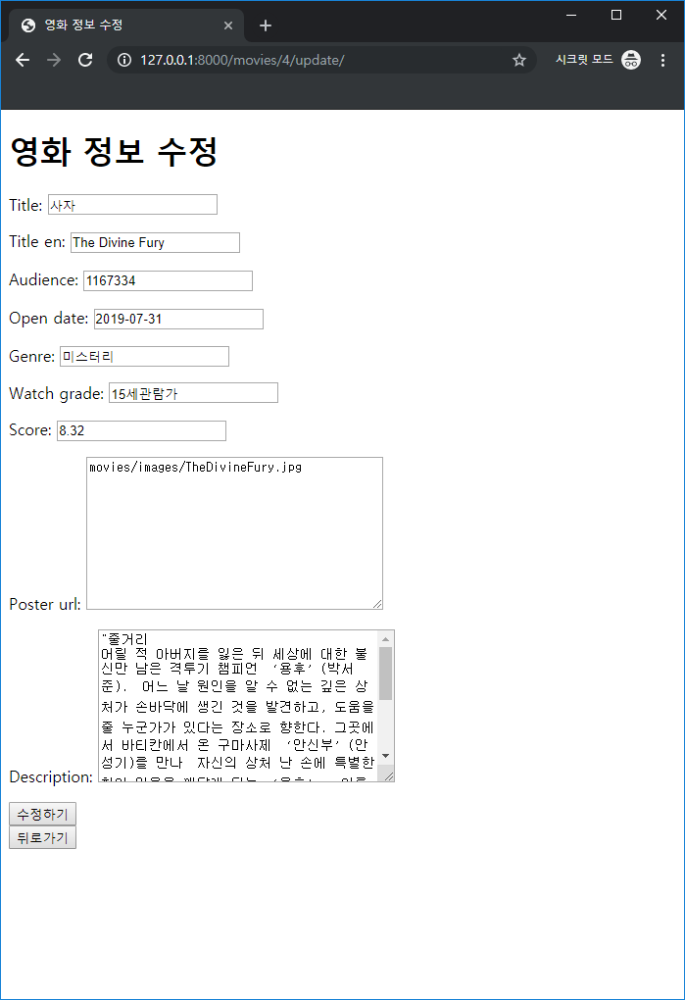
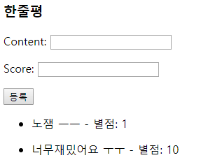

# PJT-06 README

## Django 준비사항

#### Project name: pjt06 / App name:  movies

#### Python version: 3.7.4

```bash
$ pip freeze > requirments.txt
```

- `requirements.txt`

  ```txt
  Django==2.2.6
  pytz==2019.3
  sqlparse==0.3.0
  ```

  설치법

  ```bash
  $ pip install -r requirements.txt
  ```

## 요구사항

### 1. 데이터베이스

```python
# movies/models.py
from django.db import models
from django.core.validators import MaxValueValidator

...
```

- 영화에 대한 정보

  | 필드명      | 자료형  | 설명              |
  | ----------- | ------- | ----------------- |
  | title       | string  | 영화명            |
  | title_en    | string  | 영화명(영문)      |
  | audience    | Integer | 누적 관객수       |
  | open_date   | date    | 개봉일            |
  | genre       | string  | 장르              |
  | watch_grade | string  | 관람등급          |
  | score       | Float   | 평점              |
  | poster_url  | text    | 포스터 이미지 url |
  | description | text    | 영화 소개         |

  ```python
  class Movie(models.Model):
      title = models.CharField(max_length=30)
      title_en = models.CharField(max_length=30)
      audience = models.IntegerField()
      open_date = models.DateField(auto_now=False, auto_now_add=False)
      genre = models.CharField(max_length=20)
      watch_grade = models.CharField(max_length=20)
      score = models.DecimalField(
          max_digits=4,
          decimal_places=2,
          validators=[MaxValueValidator(limit_value=10, message="10 이하의 수를 입력해주세요")]
      )  # 소수점 위 2자리 아래 2자리/ 최대값을 10으로 설정
      poster_url = models.TextField()
      description = models.TextField()
  ```

- 개별 영화에 대한 한줄평

  | 필드명   | 자료형  | 설명                       |
  | -------- | ------- | -------------------------- |
  | content  | String  | 한줄평(평가 내용)          |
  | score    | Integer | 평점                       |
  | movie_id | Integer | Movie의 Primary Key(id 값) |

  ```python
  class Review(models.Model):
      movie_id = models.ForeignKey(Movie, on_delete=models.CASCADE, related_name="reviews")
      content = models.CharField(max_length=200)
      score = models.IntegerField(
          validators=[MaxValueValidator(limit_value=10, message="10 이하의 수를 입력해주세요")]
      )
  
      class Meta:
          ordering = ('-pk',)
  
  ```

### 2. 페이지

```python
# movies/urls.py
from django.urls import path
from . import views

app_name = 'movies'
urlpatterns = [
    ...
]
```

```python
# movies/forms.py
from django import forms
from .models import Movie, Review

...
```

1. 영화목록

   - 요청 URL

     ```python
     path('', views.index, name='index'),
     ```

   - views

     ```python
     def index(request):
         movies = Movie.objects.all()
         context = {
             'movies': movies,
         }
         return render(request, 'movies/index.html', context)
     ```

   - HTML

     ```django
     
     
     
     영화목록
     
     
       <h1>영화 목록입니다.</h1>
     <!-- 영화 정보 생성 Form 으로 가기 위한 a tag -->
       <a href="">새 영화 등록</a><hr>
     
     <!-- 모든 영화 정보를 보여주기 위한 for -->
         
       <ul>
         <!-- 목록 상단에 img tag 를 사용해 사진 등록
     		static 폴더에 있는 이미지를 불러옵니다. -->
         <li><br>
         <a href="">{{ movie.title }}</a> - {{ movie.score }}</li><br>
       </ul>
       
       <p>아직 등록된 영화가 없어요 ㅜㅜ</p>
       
     
     ```

2. & 3. 영화 정보 생성 및 Form

   - 요청 URL

     ```python
     path('create/', views.create, name='create'),
     ```

   - views

     ```python
     def create(request):
         movie_form = MovieForm(request.POST or None)
         # POST로 들어온다면 그 정보를 담고 아니라면 빈 Form을 받아옵니다.
         if movie_form.is_valid():  # POST 요청이 유효하다면 정보를 저장하고 detail 페이지로 이동합니다.
             movie = movie_form.save()
             return redirect('movies:detail', movie.pk)
         context = {
             'movie_form': movie_form,
         }
         # GET 요청이거나 form 이 유효하지 않다면 create 페이지를 보여줍니다.
         return render(request, 'movies/create.html', context)
     ```

   - Form

     ```python
     # forms.py
     class MovieForm(forms.ModelForm):
         
         class Meta:
             model = Movie
             fields = '__all__'
             # 모든 필드를 받아옵니다.
     ```

   - HTML

     ```django
     
     
     영화 정보 생성
     
     
       <h1>영화 정보 생성</h1>
       <!-- 같은 url로 요청을 보내므로 따로 적어주지 않아도 됩니다. -->
       <form method="POST">
         
         {{ movie_form.as_p }}
         <!-- submit 버튼을 통해 POST 요청을 보냅니다. -->
         <button type="submit">생성하기</button> <a href=""><button>뒤로가기</button></a>
       </form>
     
     ```

4. 영화 정보 조회

   - 요청 URL

     ```python
     path('<int:movie_pk>/', views.detail, name='detail'),
     ```

   - views

     ```python
     def detail(request, movie_pk):
         movie = get_object_or_404(Movie, pk=movie_pk)
         reviews = movie.reviews.all()
         review_form = ReviewForm()
         # 해당 영화의 정보 및 한줄평, 한줄평 작성 form을 받아옵니다.
         context = {
             'movie': movie,
             'reviews': reviews,
             'review_form': review_form,
         }
         return render(request, 'movies/detail.html', context)
     ```

   - HTML

     ```django
     
     
     
     영화 정보 조회
     <!-- 해당 영화의 모든 정보를 보여줍니다. -->
     
     <h1>영화 제목 (en): {{ movie.title }} ({{ movie.title_en }})</h1>
     <h2>개봉일: {{ movie.open_date }}  평점: {{ movie.score }}</h2>
     
     <p>관람객 수: {{ movie.audience }}</p>
     <p>장르: {{ movie.genre }}</p>
     <p>줄거리: {{ movie.description }}</p>
     <a href=""><button>뒤로가기</button></a>
     <a href=""><button>수정하기</button></a>
     <form action="" method="POST"><button type="submit">삭제하기</button></form>
     <hr>
     
     <!-- POST 요청으로 한줄평을 작성하는 Form을 보여줍니다. -->
     <h3>한줄평</h3>
     <form action="" method="POST">
       
       {{ review_form.as_p }}
       <button type="submit">등록</button>
     </form>
     
     <!-- 해당 영화에 등록된 한줄평들을 보여줍니다. -->
     
     <ul>
       <li>{{ review.content }} - 별점: {{ review.score }}</li>
     </ul>
     
     <p>아직 한줄평이 없어요 ㅜㅜ</p>
     
     
     ```

5. & 6. 영화 정보 수정 및 Form

   - 요청 URL

     ```python
     path('<int:movie_pk>/update/', views.update, name='update'),
     ```

   - views

     ```python
     def update(request, movie_pk):
         movie = get_object_or_404(Movie, pk=movie_pk)
         movie_form = MovieForm(request.POST or None, instance=movie)
       	# instance 를 통해 해당 영화의 정보를 form에 담아 넘겨줍니다.
         if movie_form.is_valid():
             movie_form.save()
             return redirect('movies:detail', movie_pk)
         context = {
             'movie_form': movie_form,
         }
         return render(request, 'movies/update.html', context)
     ```

   - Form

     영화 생성과 같습니다.

   - HTML

     ```django
     
     <!-- 영화 생성 페이지와 유사합니다. -->
     영화 정보 수정
     
     
       <h1>영화 정보 수정</h1>
       <form method="POST">
         
         {{ movie_form.as_p }}
         <button type="submit">수정하기</button> <a href=""><button>뒤로가기</button></a>
       </form>
     
     ```

7. 영화 정보 삭제

   - 요청 URL

     ```python
     path('<int:movie_pk>/delete/', views.delete, name='delete'),
     ```

   - views

     ```python
     @require_POST  # POST 요청으로만 작동합니다. GET 요청으로 들어올 시 405 에러를 발생시킵니다.
     def delete(request, movie_pk):
         movie = get_object_or_404(Movie, pk=movie_pk)
         movie.delete()
         return redirect('movies:index')
     ```

8. 영화 한줄평 생성

   - 요청 URL

     ```python
     path('<int:movie_pk>/reviews/', views.reviews, name='reviews'),
     ```

   - Form

     ```python
     class ReviewForm(forms.ModelForm):
         
         class Meta:
             model = Review
             fields = ("content", "score",)
             # 모든 필드를 받아오면 movie_pk에 대한 정보도 계속
             # 받아줘야하므로 필요한 두가지만 받아옵니다.
     ```

   - views

     ```python
     def reviews(request, movie_pk):
         movie = get_object_or_404(Movie, pk=movie_pk)
         reviews = movie.reviews.all()
         review_form = ReviewForm(request.POST or None)
         if review_form.is_valid():
             # review_form 이 유효하다면 정보를 저장하고 detail 페이지로 이동합니다
             form = review_form.save(commit=False)
             form.movie_id = movie
             form.save()
             return redirect('movies:detail', movie_pk)
         # 유효하지 않다면 해당 정보를 detail 페이지로 넘겨줍니다.
         context = {
             'movie': movie,
             'reviews': reviews,
             'review_form': review_form,
         }
         return render(request, 'movies/detail.html', context)
     ```

## 실행 결과

- Index 페이지

  

- 영화정보생성 페이지

  

- 영화정보조회 페이지

  

- 영화정보 수정 페이지

  

- 한줄평

  

