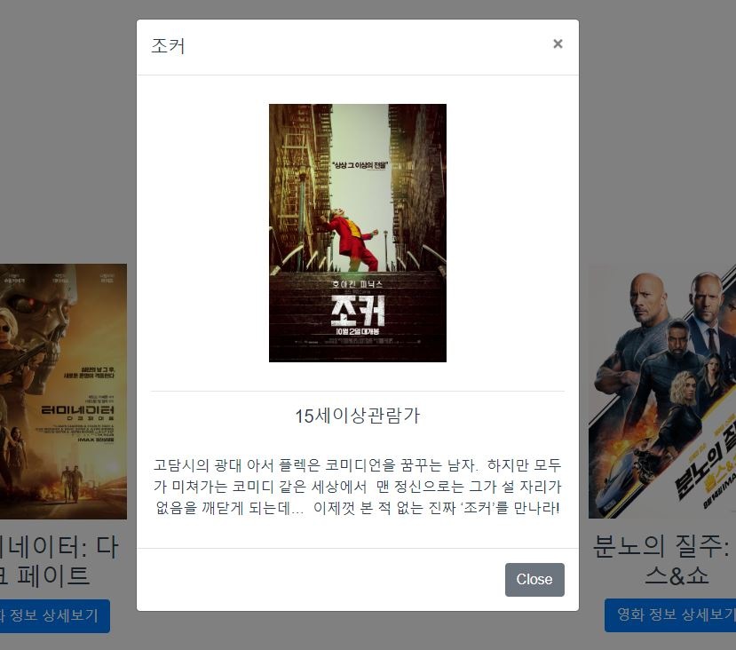

# PJT - 09

## Vue

### 준비사항

Node 개발 환경 12.x, Vue 2.x

```bash
$ npm install
```

### 컴포넌트 구조

`App.vue` => `MovieList.vue` => `MovieListItem.vue` => `MovieListItemModal`

#### 1. App.vue

- 최상위 컴포넌트로 실행되는 시점에 axios를 이용해 `movies.json`, `genres.json`을 받아옵니다.
- 가져온 데이터는 MovieList.vue 컴포넌트로 전달합니다.

```vue
<template>
  <div id="app">
    <div class="container">
      <!-- 1-3. 호출하시오. 
        필요한 경우 props를 데이터를 보내줍니다.
      -->
      <movie-list :movies="movies" :genres="genres"/>
    </div>
  </div>
</template>

<script>
const axios = require('axios');
// 1-1. 저장되어 있는 MovieList 컴포넌트를 불러오고,
import MovieList from './components/movies/MovieList.vue'
// import { async } from 'q';

export default {
  name: 'app',
  // 1-2. 아래에 등록 후
  components: {
    MovieList: MovieList,
  },
  // props: {
  //   movies: Array,
  //   genres: Array,
  // },
  data() {
    return {
      // 활용할 데이터를 정의하시오.
      movies: [],
      genres: [],
    }
  },
  methods: {
    getMovies: async function () {
      const MOVIE_API_URL = 'https://gist.githubusercontent.com/edujason-hphk/f57d4cb915fcec433ece535b2f08a10f/raw/612fd3f00468722ead2cfe809f14e38230b47686/movie.json'
      const response = await axios.get(MOVIE_API_URL)
      this.movies = response.data
    }
  },
  mounted() { // create와 유사한
    // 0. mounted 되었을 때, 
    // 1) 제시된 URL로 요청을 통해 data의 movies 배열에 해당 하는 데이터를 넣으시오.
    // const MOVIE_API_URL = 'https://gist.githubusercontent.com/edujason-hphk/f57d4cb915fcec433ece535b2f08a10f/raw/612fd3f00468722ead2cfe809f14e38230b47686/movie.json'
    // axios.get(MOVIE_API_URL)
    //   .then(response => this.movies = response.data)
    this.getMovies()
    // 2) 제시된 URL로 요청을 통해 data의 genres 배열에 해당 하는 데이터를 넣으시오.
    const GENRE_API_URL = 'https://gist.githubusercontent.com/edujason-hphk/eea9c85a937cbf469b8f55fd7f8524df/raw/68bad38a2bc911d3a39bce26d6dd9b68a7efe849/genre.json'
    axios.get(GENRE_API_URL)
      .then(response => {
        this.genres.push({
          id: 0,
          name: '전체보기',
        })
        this.genres = this.genres.concat(response.data)
        })
    // axios는 위에 호출되어 있으며, node 설치도 완료되어 있습니다.
  },
}
</script>

<style>
#app {
  font-family: 'Avenir', Helvetica, Arial, sans-serif;
  -webkit-font-smoothing: antialiased;
  -moz-osx-font-smoothing: grayscale;
  text-align: center;
  color: #2c3e50;
  margin-top: 60px;
}
</style>

```

#### 2. MovieList.vue

- 영화목록을 구성하는 컴포넌트로 개별 영화 컴포넌트를 배치합니다.
- 드롭다운을 통한 장르 선택시 실시간으로 변경합니다.
- 미선택시에는 모든 영화를 출력합니다.
- 개별 영화 정보들을 MovieListItem.vue 로 전달합니다.

```vue
<template>
  <div>
    <h1>영화 목록</h1>
    <h2>장르 선택</h2>
    <!-- 2. 장르 선택(제일 마지막에 구현하시오.)
    2-1. App 컴포넌트로 부터 받은 genres를 반복하여 드롭다운을 완성 해주세요.
    2-2. 드롭다운은 selectedGenreId data와 양방향바인딩(v-model)이 됩니다.
    2-3. 값 변경이 되면, 특정한 함수를 실행 해야합니다.
     -->
    <select class="form-control" v-model="selectedGenreId">
      <option v-for="genre in genres" :key="genre.id" :value="genre.id">
        {{ genre.name }}
      </option>
    </select>
    <div class="row mt-5">
      <!-- 1-3. 반복을 통해 호출하시오. 
        필요한 경우 props를 데이터를 보내줍니다.
      -->
      <movie-list-item :movie="movie" v-for="movie in selected" :key="movie.id"/>
      <!-- (나중에 마지막으로) selectedGenreId 값에 따른 분기를 해야 합니다.

       -->
    </div>
  </div>
</template>

<script>
// 1-1. 저장되어 있는 MovieListItem 컴포넌트를 불러오고,
import MovieListItem from './MovieListItem.vue'

export default {
  name: 'MovieList',
  // 1-2. 아래에 등록 후
  components: {
    MovieListItem: MovieListItem,
  },
  data () {
    return {
      // 활용할 데이터를 정의하시오.
      'selectedGenreId': 0,
    }
  },
  // 0. props 데이터를 받이 위하여 설정하시오.
  props: {
    'movies': {
      type: Array,
      required: true,
    },
    'genres': {
      type: Array,
      required: true,
    }},
  // genres와 movies 모두 타입은 Array이며, 필수입니다.
  // 설정이 완료 되었다면, 상위 컴포넌트에서 값을 넘겨 주세요.
  // 그리고 적절한 곳에 사용하세요.
  
  // 2-3.에서 이야기하는 특정한 함수는 selectedGenreId의 값이 변경될 때마다 호출 됩니다.
  // 드랍다운에서 장르를 선택하면, 해당 영화들만 보여주도록 구현 예정입니다.
  // 주의할 것은 직접 부모 컴포넌트의 데이터를 변경할 수 없다는 점입니다.
  computed: {
    selected: function() {
      if (this.selectedGenreId === 0) {
        return this.movies
      }
      else {
        return this.movies.filter(movie => movie.genre_id === this.selectedGenreId)
      }
    },
  },
  // 완료 후
}
</script>

<style>
select {
  display: block;
  width: 50% !important;
  margin: 2rem auto !important;
}
</style>
```

#### 3. MovieListItem

- 개별 영화를 포스터, 제목, 상세보기 버튼으로 구성한 컴포넌트입니다.
- 상세보기 버튼을 누르면 MovieListItemModal.vue 를 확인할 수 있으며 해당 영화 정보를 건내줍니다.

```vue
<template>
  <div class="col-3 my-3">
    <!-- img 태그에 src와 alt값(영화제목)을 설정하시오 -->
    
    <!-- 영화 제목을 출력하시오. -->
    <h3>{{ movie.name }}</h3>
    <!-- 모달을 활용하기 위해서는 data-taget에 모달에서 정의된 id값을 넣어야 합니다. -->
    <button class="btn btn-primary" data-toggle="modal" :data-target="'#m' + movie.id">영화 정보 상세보기</button>
    <!-- 1-3. 호출하시오.
      필요한 경우 props를 데이터를 보내줍니다.
      -->
    <movie-list-item-modal :id="'m' + movie.id" :movie="movie"/>
  </div>
</template>

<script>
// 1-1. 저장되어 있는 MovieListItemModal 컴포넌트를 불러오고,
import MovieListItemModal from './MovieListItemModal.vue'

export default {
  name: 'MovieListItem',
  // 1-2. 아래에 등록 후
  components: {
    MovieListItemModal: MovieListItemModal
  },
  // 0. props 데이터를 받기 위하여 설정하시오.
  props: {
    'movie': {
      type: Object,
      required: true,
    }
  },
  // movie 타입은 Object이며, 필수입니다.
  // 설정이 완료 되었다면, 상위 컴포넌트에서 값을 넘겨 주세요.
  // 그리고 적절한 곳에 사용하세요.

  data () {
    // 활용할 데이터를 정의하시오.
    return {
    }
  }
}
</script>

<style>
.movie--poster {
  width: 200px;
}
</style>
```

#### 4. MovieListItemModal

- 영화 상세보기를 누르면 보이는 컴포넌트입니다.

```vue
<template>
<!-- vue 콘솔에서 확인하여, 추가 정보들도 출력하세요. -->
<!-- 고유한 모달을 위해 id 속성을 정의하시오. 예) movie-1, movie-2, ... -->
<div class="modal fade" tabindex="-1" role="dialog" :id="'m' + movie.id">
  <div class="modal-dialog" role="document">
    <div class="modal-content">
      <div class="modal-header">
        <!-- 영화 제목을 출력하세요. -->
        <h5 class="modal-title">{{ movie.name }}</h5>
        <button type="button" class="close" data-dismiss="modal" aria-label="Close">
          <span aria-hidden="true">&times;</span>
        </button>
      </div>
      <div class="modal-body">
        <hr>
        <h5>{{ movie.rating }}</h5><br>
        <!-- 영화 설명을 출력하세요. -->
        <p>{{ movie.description }}</p>
      </div>
      <div class="modal-footer">
        <button type="button" class="btn btn-secondary" data-dismiss="modal">Close</button>
      </div>
    </div>
  </div>
</div>
</template>

<script>
export default {
  name: 'movie-list-item-modal',
  // 0. props 데이터를 받이 위하여 설정하시오.
  props: {
    'movie': {
      type: Object,
      required: true,
    }
  }
  // movie 타입은 Object이며, 필수입니다.
  // 설정이 완료 되었다면, 상위 컴포넌트에서 값을 넘겨 주세요.
  // 그리고 적절한 곳에 사용하세요.
}
</script>

<style>
.movie--poster {
  width: 200px;
}
</style>
```

### 실행결과





